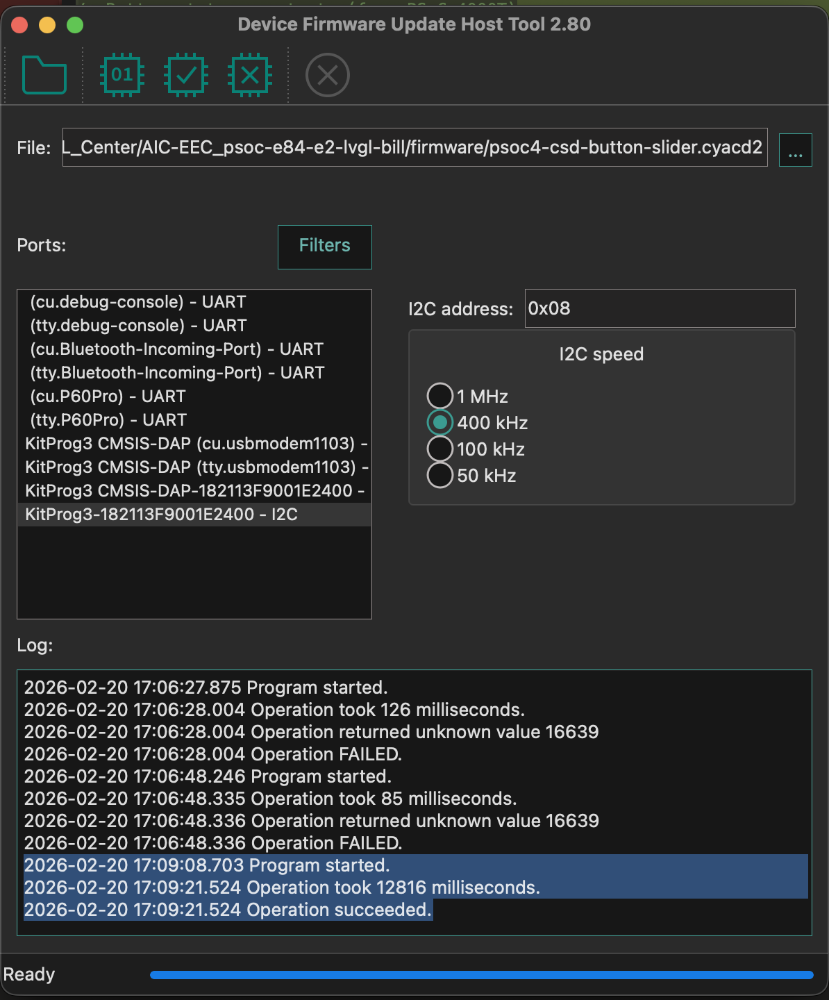

# AIC-EEC: Embedded Systems and IoT Development - PSoC Edge E84

LVGL-based course examples for **Embedded Systems and IoT Development**, Department of Electrical Engineering, Faculty of Engineering, Burapha University.

Runs on **PSoC Edge E84 Evaluation Kit** with Waveshare 4.3" DSI display (800x480).

---

## Requirements

### Hardware

- PSoC Edge E84 Evaluation Kit (`KIT_PSE84_EVAL_EPC2`)
- Waveshare 4.3" Raspberry Pi DSI LCD (800x480) - default
- USB cable (KitProg3)

### Software

- [ModusToolbox](https://www.infineon.com/modustoolbox) v3.6+
- GNU Arm Embedded Compiler v14.2.1 (GCC_ARM) - included with ModusToolbox
- Terminal emulator (115200 baud, 8N1)

---

## Project Structure

```
AIC-EEC_psoc-e84-e2-lvgl-bill/
├── proj_cm33_s/              CM33 Secure core (boot + security)
├── proj_cm33_ns/             CM33 Non-Secure core (IPC, WiFi, Sensors)
├── proj_cm55/                CM55 core (LVGL display + examples)
│   ├── example_selector.h    <-- Select Part + Example here
│   ├── main.c                Main entry point
│   ├── aic-eec/              AIC-EEC library (GPIO, Sensors, etc.)
│   ├── ipc/                  IPC communication (CM55 side)
│   ├── part1/                Part 1: LVGL Basics + GPIO
│   ├── demo/                 LVGL demo image assets
│   └── lvgl_patches/         LVGL library patches
├── shared/                   Shared IPC headers (CM33 <-> CM55)
├── common.mk                Shared build settings
└── Makefile                  Top-level build
```

---

## Select Example

Edit `proj_cm55/example_selector.h`:

```c
#define SELECTED_PART       1    // Part (1) or Demo ('A','B','C')
#define SELECTED_EXAMPLE    1    // Example number (ignored for demos)
```

### LVGL Built-in Demos

| SELECTED_PART | Demo |
|---------------|------|
| `'A'` | Music Player |
| `'B'` | Benchmark |
| `'C'` | Widgets (may cause GPU hang on 4.3" display) |

---

## Build & Program

```bash
# Build all cores
make build

# Flash to board
make program
```

> **Toolchain:** GCC_ARM (default). Set `TOOLCHAIN=GCC_ARM` in `common.mk` or pass via command line.

---

## Examples

### Part 1: LVGL Basics + GPIO (11 Examples)

**Section I — UI Only**

| # | Example | Description |
|---|---------|-------------|
| 1 | Hello World | Label, Align, Style |
| 2 | Button Counter | Button, Event Callback |
| 3 | LED Control | LED Widget, Slider, Brightness |
| 4 | Switch Toggle | Switch, State Check |
| 5 | GPIO Dashboard | Layout, Multiple Widgets |

**Section II — Hardware Integration**

| # | Example | Description |
|---|---------|-------------|
| 6 | [HW] LED Control | Hardware LED (3 LEDs) |
| 7 | [HW] Button Status | Hardware Button Read |
| 8 | [HW] ADC Display | Potentiometer ADC |
| 9 | [HW] GPIO Dashboard | Full Hardware Dashboard |
| 10 | [HW] CAPSENSE Mockup | CAPSENSE UI Mockup |
| 11 | [HW] CAPSENSE | Real CAPSENSE Hardware (requires firmware, see below) |

> `[HW]` = requires hardware peripherals (LEDs, buttons, sensors, IPC)

---

## Architecture

### Multi-Core Design

```
CM33-S (Secure)     → Boot + Security config
CM33-NS (Non-Secure) → IPC, WiFi, BLE, Sensor I2C
CM55 (Application)   → LVGL display, UI examples
```

### IPC Communication (CM33-NS <-> CM55)

- CM33-NS handles hardware peripherals (GPIO, I2C, WiFi)
- CM55 handles LVGL display rendering
- IPC pipe for inter-core messaging
- Both cores need `IPC_ENABLED=1` in Makefile

---

## Display Configuration

Default: Waveshare 4.3" (800x480)

To change display, edit `CONFIG_DISPLAY` in `common.mk`:

```makefile
CONFIG_DISPLAY = W4P3INCH_DISP       # 4.3" 800x480 (default)
# CONFIG_DISPLAY = WS7P0DSI_RPI_DISP # 7" 1024x600
# CONFIG_DISPLAY = WF101JTYAHMNB0_DISP # 10.1" 1024x600
```

---

## PC Simulator

For testing UI without hardware, see the companion project:
[lv_port_pc_vscode_aic-eec](https://github.com/Advance-Innovation-Centre-AIC/lv_port_pc_vscode_aic-eec)

---

## CAPSENSE Setup (Required for Part 1 Ex 11, Part 4 Ex 9)

The PSoC Edge E84 board has a **PSoC 4000T** CAPSENSE co-processor (2 buttons + 1 slider) connected via I2C (SCB0, address 0x08). It requires firmware to be programmed **once** before use.

### Step 1: Erase PSoC Edge E84 application

The PSoC 4000T shares the I2C bus (P8_0/P8_1) with KitProg3. The running application must be erased first to free the bus:

```bash
make erase
```

### Step 2: Program PSoC 4000T firmware via DFU

1. Open **DFU Host Tool** from ModusToolbox (Quick Panel or search "DFU")
2. Select firmware file: `firmware/psoc4-csd-button-slider.cyacd2`
3. Configure:
   - Port: **KitProg3 - I2C**
   - I2C Address: **8**
   - I2C Speed: **400 kHz**
4. Close all serial terminals
5. Click **Program** and wait for "Operation succeeded"



### Step 3: Re-program PSoC Edge E84 application

```bash
make program
```

### Step 4: Power cycle

Unplug and replug USB to ensure PSoC 4000T boots into application mode.

> **Note:** This only needs to be done once. The PSoC 4000T firmware persists across PSoC Edge E84 re-programming.

---

## Troubleshooting

### Build fails with LLVM_ARM errors

Use GCC_ARM instead:
```bash
make build TOOLCHAIN=GCC_ARM
```

### CM33-NS printf causes crash

CM33-NS does **not** have retarget-io. Never use `printf()` in CM33-NS code.

### CAPSENSE reads 0xFF (all bytes)

PSoC 4000T firmware not programmed. Follow [CAPSENSE Setup](#capsense-setup-required-for-part-1-ex-11-part-4-ex-9) above.

### DFU programming fails (error 16639)

PSoC Edge E84 application is blocking the I2C bus. Run `make erase` first, then retry DFU.

### IPC messages not received

1. Ensure both CM33-NS and CM55 Makefiles have `IPC_ENABLED=1`
2. Check boot order: `__enable_irq()` -> `cm33_ipc_init()` -> `Cy_SysEnableCM55()`
3. Add 50ms delay after `cm33_ipc_communication_setup()`

---

(C) 2026 BiiL - Embedded Systems and IoT Development, Burapha University
